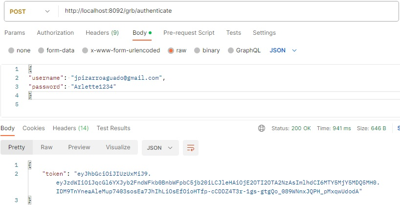
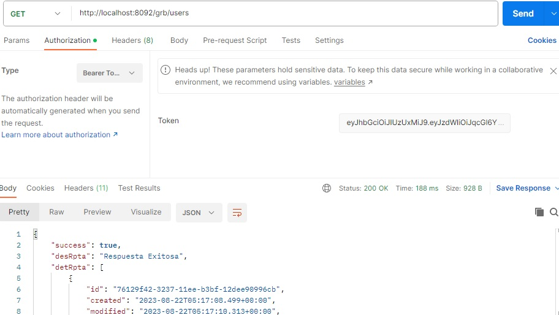
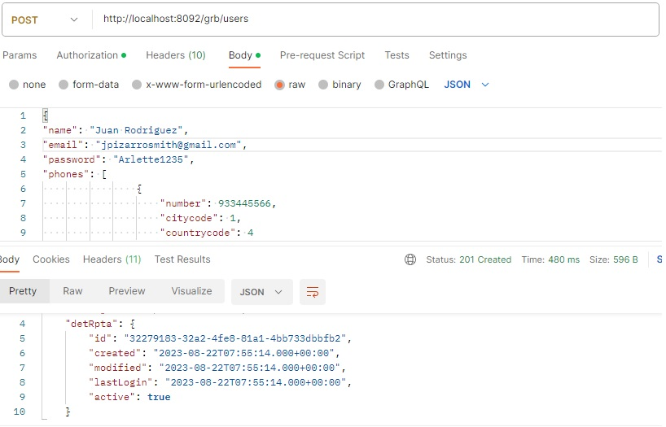

# mrs-users-grb
A continuacion de indicara el flujo para el proceso.
**Spring boot application  REST API  se tiene expuesto en el puerto 8092.**
**Consideraciones:**

1.- Java 11

2.- Gradle

3.- Habilitar Lombok

## 1. peticion del authenticate 
http://localhost:8092/grb/authenticate POST

**body:**

{
"username": "jpizarroaguado@gmail.com",
"password": "Arlette1234"
}

 obs: se tiene un usuario inicial de prueba.
 

## 1. validacion del jwt en la lista usuarios 
http://localhost:8092/grb/users  GET

 
## 2. validacion del jwt y creacion de  usuario 
http://localhost:8092/grb/users POST

**body:**

{
"name": "Juan Rodriguez",
"email": "jpizarrosmith@gmail.com",
"password": "Arlette1235",
"phones": [
               {
                    "number": 933445566,
                    "citycode": 1,
                    "countrycode": 4
                }
           ]        
}

 
